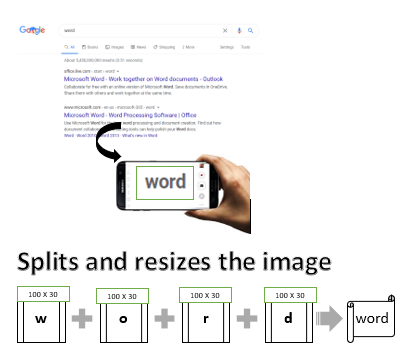

# ML_Project
# Content: Supervised Learning ( classification )
## Project: Predicting text from images

## Data : Image file (BMP, JPG, PNG)
## Project Overview
In this project, we have applied supervised learning techniques to accurately read the alphabets from images in any format. We first extract the image data into numeric format. Next, we apply a series of transformations and preprocessing techniques to manipulate the data into a workable format.Finally, RandomForestClassifer predicts the text represented in the image file. 

Steps:
- We capture a text using mobile camera.
- We add that file in the input function in the file in MASTER.ipynb
- The code resizes the image to (100 X 30) and converts that image pixels in numeric data.
- Next, code runs series of tranformations and preprocessing on the data.
- Finally, we have data containing 3002 features associated to each record.
- The ml.py file outputs the result containing the predicted text.

This project uses the following software and Python libraries:

- [Python 3.1](https://www.python.org/download/releases/3.1/)
- [NumPy](http://www.numpy.org/)
- [Pandas](http://pandas.pydata.org/)
- [scikit-learn](http://scikit-learn.org/stable/)
- [matplotlib](http://matplotlib.org/)
- [pillow](https://pillow.readthedocs.io/)

This project contains four files:

- `Curved.csv`: The curved feature prediction dataset.
- `Linear.csv`: The Linear feature prediction dataset.
- `data_image_reco.csv`: The main project dataset. 
- `MAIN.ipynb`: This is the main file where you will be performing your work on the project.
- `LINEAR.py`: A Python file containing machine learning model to predict linearity of the alphabet image.
- `CURVED.py`: A Python file containing machine learning model to predict curvability of the alphabet image.
- `ML.py`: This is the main file where  you will be performing machine learning model to predict final output.

